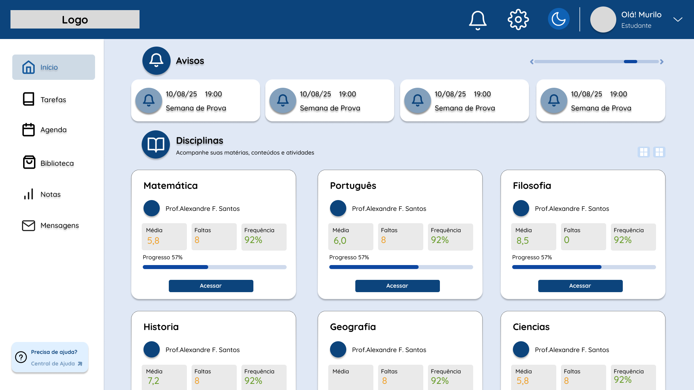
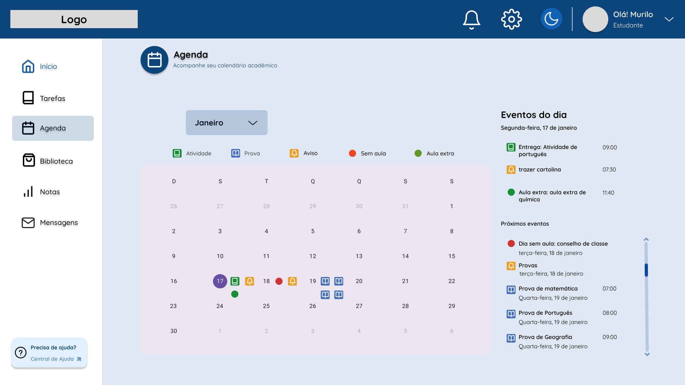
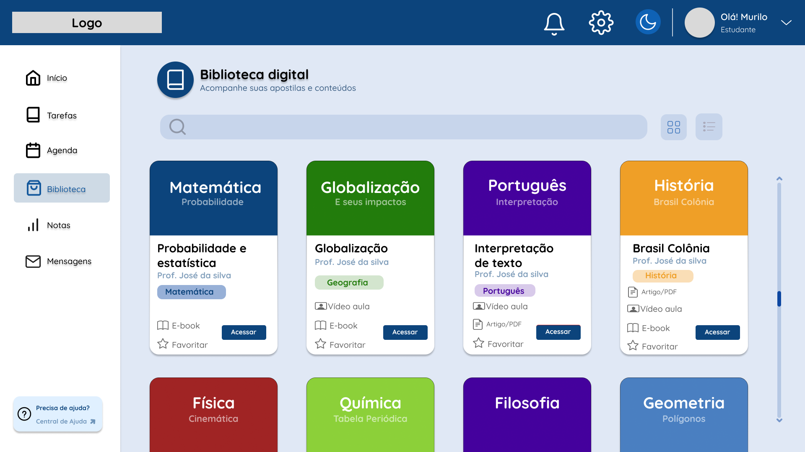
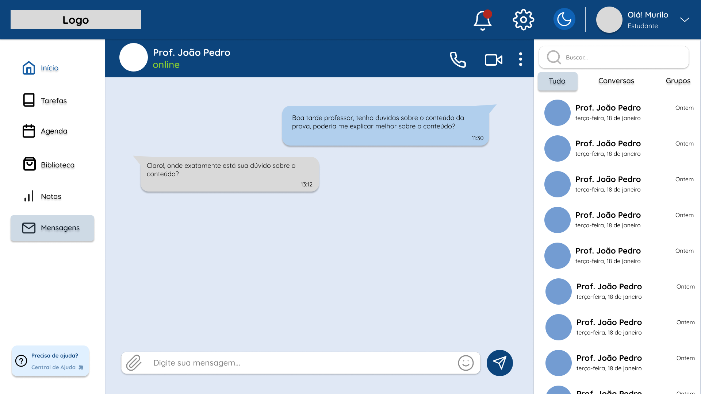

# RED - Rede Educacional Digital

## Sobre o Projeto

O **RED (Rede Educacional Digital)** é uma plataforma web desenvolvida para centralizar e otimizar a comunicação entre **professores, alunos e responsáveis**.

A proposta do sistema é substituir a fragmentação atual (WhatsApp, agendas físicas e e-mails) por um **ambiente único, organizado e eficiente**, melhorando a gestão escolar e o acompanhamento acadêmico.

---

##  Problema

Atualmente, a comunicação escolar é:

* Fragmentada em múltiplos canais
* Desorganizada e informal
* Pouco eficiente para acompanhamento dos alunos

Isso gera:

* Perda de informações importantes
* Sobrecarga para professores
* Baixo engajamento dos responsáveis

---

## Solução

O RED atua como um **hub educacional centralizado**, oferecendo:

*  Agenda digital
*  Comunicação integrada (chat)
*  Acompanhamento de desempenho (notas e tarefas)
*  Biblioteca digital de materiais
*  Notificações em tempo real

---

##  Público-Alvo

* **Professores** → redução de tarefas administrativas
* **Alunos** → organização do aprendizado
* **Responsáveis** → acompanhamento em tempo real

---

##  Tecnologias Utilizadas

### Frontend

* HTML5
* CSS3
* JavaScript
* React

### Backend

* Python (API REST)

### Banco de Dados

* PostgreSQL

### Ferramentas

* Git & GitHub
* Figma
* VS Code

---

##  Arquitetura

O sistema segue uma arquitetura em **3 camadas (3-Tier)**:

* **Frontend** → Interface do usuário
* **Backend** → Regras de negócio e API
* **Banco de Dados** → Armazenamento

###  Fluxo de funcionamento

Usuário → Frontend → Backend → Banco de Dados → Backend → Frontend

---

##  Protótipos

🔗 Acesse o protótipo completo no Figma:
https://www.figma.com/design/APr17NQmZgkqVOqWzSZZHx/AGENDA-EDU

### Telas principais (protótipos)

### Tela Inicial


### Agenda


### Biblioteca


### Tarefas


### Mensagens

##  Estrutura do Projeto

```bash
/
├── docs/
│   ├── requisitos.md
│   ├── regras-negocio.md
│   ├── arquitetura.md
│   ├── banco-de-dados.md
│   ├── casos-de-uso.md
│   └── diagramas/
├── frontend/
├── backend/
├── assets/
└── README.md
```

---

##  Funcionalidades Principais

* Sistema de login e cadastro
* Gestão de tarefas com prazos
* Agenda escolar digital
* Biblioteca de materiais didáticos
* Comunicação entre usuários
* Visualização de histórico escolar
* Sistema de notificações

---

##  Segurança

* Controle de acesso por perfil (RBAC)
* Proteção de dados dos usuários
* Registro de alterações no sistema
* Bloqueio após tentativas inválidas de login

---

##  Diferenciais

* Centralização total da comunicação escolar
* Organização por trilhas de aprendizagem
* Redução da carga administrativa docente
* Aumento do engajamento familiar

---

##  Status do Projeto

🚧 Em desenvolvimento

Atualmente na fase de:

* Implementação do frontend
* Estruturação do banco de dados
* Integração futura com backend